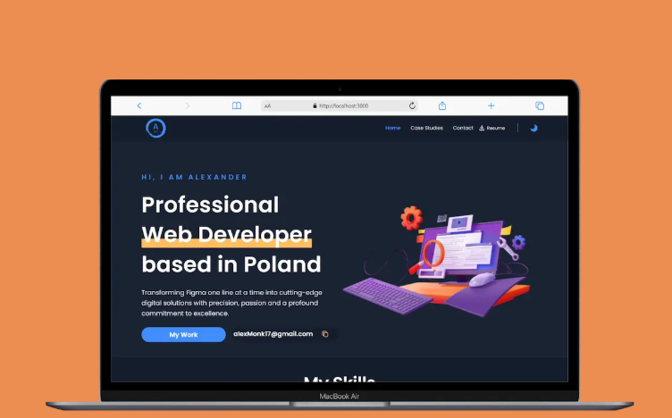

<div align="center">

# Portfolio — Alexander

**My personal portfolio** — dark-first UI, case studies, contact, and CMS-backed content. This repository exists so anyone browsing the code can see what the project is and which technologies it uses; it is **not** a template or starter for others to copy and run.

[](https://nextjs.org/)
[](https://www.typescriptlang.org/)
[](https://www.sanity.io/)

[Live site](https://portfolio-alexander.vercel.app/)

</div>

---

## Preview

<p align="center">
  <a href="https://portfolio-alexander.vercel.app/">
    
  </a>
</p>

<p align="center">
  <em>Home: hero, skills strip, services, experience, projects, testimonials, and CTA — with light/dark theme.</em>
</p>

---

## About

I am **Alexander**, a **web developer based in Poland**. The site showcases my work as case studies, along with skills, experience, and testimonials. Content is edited in **Sanity**; the public site is **Next.js** (App Router), **TypeScript**, and **Tailwind**.

---

## Features

| Area | Details |
|------|---------|
| **Home** | Hero with animated copy, email copy-to-clipboard, skills, services, timeline, featured projects, testimonials |
| **Case studies** | Listing and individual project pages (`/case-studies`, `/case-studies/[id]`) |
| **Contact** | Form powered by **EmailJS** |
| **Resume** | Download link from the main navigation |
| **Theming** | **next-themes** — light/dark with system-friendly defaults |
| **CMS** | **Sanity Studio** at `/studio` for structured content |
| **Motion** | **Framer Motion** for scroll and entrance animations |

---

## Tech stack

- **Framework:** [Next.js](https://nextjs.org/) 13 (App Router)
- **Language:** [TypeScript](https://www.typescriptlang.org/)
- **UI:** [Tailwind CSS](https://tailwindcss.com/), [NextUI](https://nextui.org/)
- **CMS:** [Sanity](https://www.sanity.io/) + [next-sanity](https://github.com/sanity-io/next-sanity)
- **Forms:** [React Hook Form](https://react-hook-form.com/) + [Zod](https://zod.dev/)
- **Email:** [@emailjs/browser](https://www.emailjs.com/)
- **State:** [Zustand](https://github.com/pmndrs/zustand)
- **Animation:** [Framer Motion](https://www.framer.com/motion/)

---

## Repository layout

```
app/
  (root)/          # Marketing site — home, case studies, contact
  (studio)/        # Sanity Studio
components/        # Page sections and shared UI
sanity/            # Queries and Sanity client
```

---

<div align="center">

Built with Next.js · TypeScript · Tailwind · Sanity

</div>
